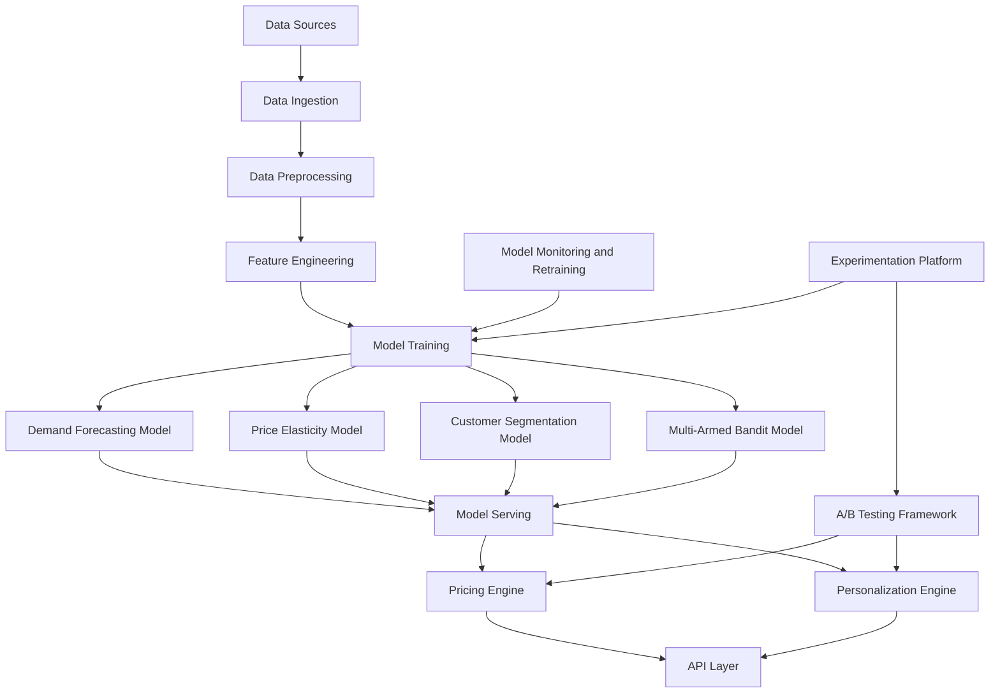

# Retail Pricing Engine [Work in Progress]
This project implements a machine learning-based retail pricing engine for dynamic pricing and personalized marketing. The system leverages advanced ML techniques including demand forecasting, price elasticity modeling, customer segmentation, and multi-armed bandits to optimize retail revenue.

# Architecture

