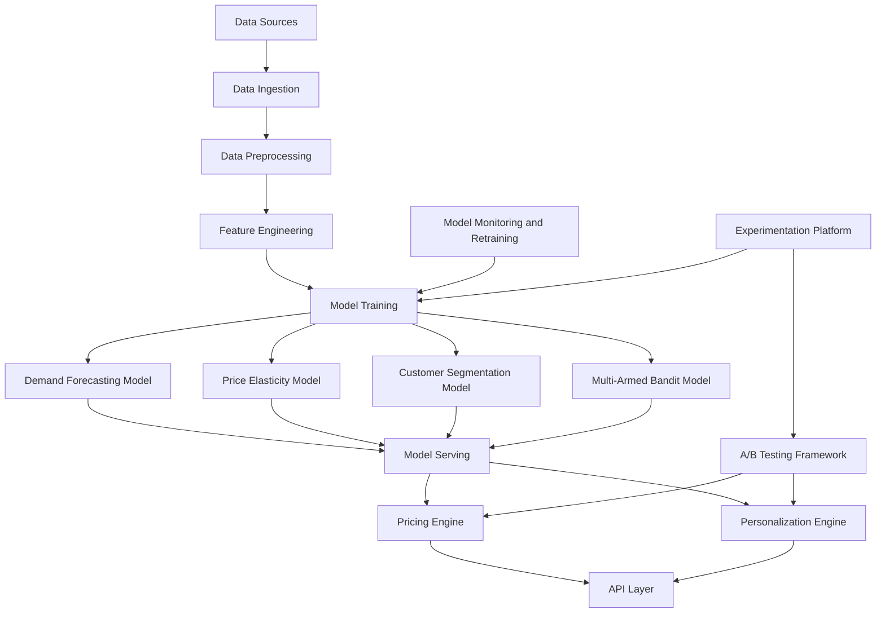

# Retail Pricing Engine [Work in Progress]
This project implements a machine learning-based retail pricing engine for dynamic pricing and personalized marketing. The system leverages advanced ML techniques including demand forecasting, price elasticity modeling, customer segmentation, and multi-armed bandits to optimize retail revenue.

# Architecture


## System Components

1. **Data Sources**: 
   - Sales data (transactions, product info)
   - Customer data (demographics, purchase history)
   - Store data (location, size, inventory)
   - External data (competitor prices, market trends, weather)

2. **Data Ingestion**: 
   - Batch processing for historical data
   - Stream processing for real-time data
   - Apache Kafka for message queuing and data streaming

3. **Data Preprocessing**: 
   - Data cleaning (handling missing values, outliers)
   - Data normalization and standardization
   - Time series alignment (for multi-store data)
   - Data anonymization for privacy compliance

4. **Feature Engineering**: 
   - Time-based features (e.g., day of week, month, seasonality)
   - Lag features for time series models
   - Price elasticity features
   - Customer segmentation features
   - Product attributes and categorization features

5. **Model Training**: 
   - Demand Forecasting Model: LSTM or Prophet for time series forecasting
   - Price Elasticity Model: ElasticNet or GradientBoostingRegressor
   - Customer Segmentation Model: K-means clustering or Gaussian Mixture Models
   - Multi-Armed Bandit Model: Contextual Thompson Sampling

6. **Model Serving**: 
   - TensorFlow Serving or MLflow for model deployment
   - Model versioning and A/B testing capabilities
   - Model registry for tracking model lineage

7. **Pricing Engine**: 
   - Combines outputs from demand forecasting and price elasticity models
   - Implements business rules and constraints (e.g., minimum margins)
   - Uses multi-armed bandit for price optimization
   - Generates price recommendations at hourly intervals

8. **Personalization Engine**: 
   - Leverages customer segmentation model for targeted marketing
   - Implements collaborative filtering for product recommendations
   - Uses multi-armed bandit for offer optimization

9. **API Layer**: 
   - RESTful APIs for integration with front-end systems
   - Rate limiting and authentication
   - Endpoints for price recommendations and personalized offers

10. **Model Monitoring and Retraining**: 
    - Tracks model performance metrics
    - Implements drift detection for input data and model outputs
    - Automated retraining pipelines based on performance thresholds

11. **A/B Testing Framework**: 
    - System for running controlled experiments
    - Tests for pricing strategies and personalized offers
    - Statistical analysis tools for experiment results

12. **Experimentation Platform**: 
    - Platform for data scientists to test new models and features
    - Jupyter notebooks for interactive analysis
    - Version control for experiments and model code

## Key Features

- Real-time dynamic pricing with hourly updates
- Personalized marketing and product recommendations
- Continuous learning and adaptation to market changes
- Scalable architecture to handle increasing data volumes
- Interpretable model decisions for business insights
- Comprehensive A/B testing framework for strategy validation
- Robust monitoring and automated model retraining

## Data Generation

This project uses mock data for retail pricing analysis. Follow these steps to set up the project and generate the necessary data:

1. **Clone the Repository**
   ```
   git clone https://github.com/yourusername/retail-pricing-engine.git
   cd retail-pricing-engine
   ```

2. **Set Up Python Environment**
   It's recommended to use a virtual environment:
   ```
   python -m venv venv
   source venv/bin/activate  # On Windows, use `venv\Scripts\activate`
   ```

3. **Install Dependencies**
   ```
   pip install -r requirements.txt
   ```

4. **Generate Mock Data**
   Run the data generation script:
   ```
   python src/data/generate_mock_data.py
   ```
   This will create the following CSV files in the `data/raw/` directory:
   - `sales_data.csv`: 1 million records of sales transactions
   - `product_data.csv`: 1,000 product records
   - `customer_data.csv`: 100,000 customer records
   - `store_data.csv`: 25 store records
   - `external_data.csv`: 1 million records of external market data

5. **Verify Data Generation**
   Check that the CSV files have been created in the `data/raw/` directory.

### Notes
- The data generation script creates mock data and should not be used for actual retail analysis.
- The generated CSV files are not tracked by Git. If you need the data, run the generation script.
- You can modify the `generate_mock_data.py` script to change the number of records generated.

## Data Preprocessing

After generating the mock data, the next step is to preprocess it for analysis. Follow these steps:

1. **Run the Preprocessing Script**
   Execute the following command:
   ```
   python src/data/preprocess_data.py
   ```
   This script performs several preprocessing steps on the raw data.

2. **Preprocessing Steps**
   The script applies the following transformations:
   - Data Cleaning:
     - Handles missing values by filling with median (for numeric data) or mode (for categorical data)
     - Handles outliers using a standard deviation approach
   - Data Normalization and Standardization:
     - Applies standardization to numeric columns
   - Time Series Alignment:
     - Ensures all time-based data covers the same period
   - Data Anonymization:
     - Replaces personal information (names, emails, cities) with fake data for privacy compliance

3. **Verify Processed Data**
   Check that the processed CSV files have been created in the `data/processed/` directory. You should see the following files:
   - `sales_data_processed.csv`
   - `product_data_processed.csv`
   - `customer_data_processed.csv`
   - `store_data_processed.csv`
   - `external_data_processed.csv`

### Note
The preprocessing script modifies the mock data and should not be used for actual retail analysis. The processed CSV files are not tracked by Git. If you need the processed data, run both the data generation and preprocessing scripts.

## Feature Engineering

After preprocessing the data, we perform feature engineering to create new features that may be useful for our pricing model. Follow these steps:

1. **Run the Feature Engineering Script**
   Execute the following command:
   ```
   python src/features/feature_engineering.py
   ```
   This script creates new features based on the preprocessed data.

2. **Feature Engineering Steps**
   The script performs the following feature engineering tasks:
   - Time-based Features:
     - Day of week, month, quarter
     - Weekend indicator
   - Lag Features:
     - Creates lagged sales features (1 day, 7 days, 30 days)
   - Price Elasticity:
     - Calculates price elasticity based on price and demand changes
   - Customer Segmentation:
     - Uses K-means clustering to create customer segments
   - Product Features:
     - One-hot encodes product categories
     - Creates price range categories

3. **Verify Feature-Engineered Data**
   Check that the feature-engineered CSV files have been created in the `data/feature_engineered/` directory. You should see the following files:
   - `sales_features.csv`
   - `customer_features.csv`
   - `product_features.csv`

### Note
The feature engineering script creates new features based on the preprocessed mock data. These features are designed to be useful for a retail pricing model but should not be used for actual retail analysis without further validation.

